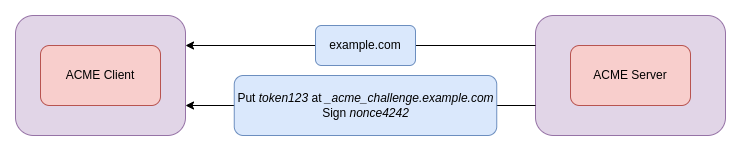
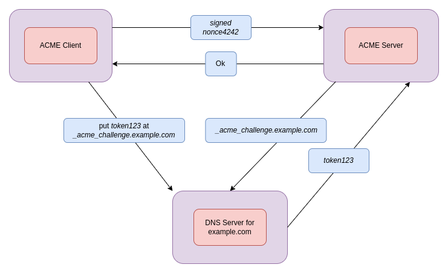
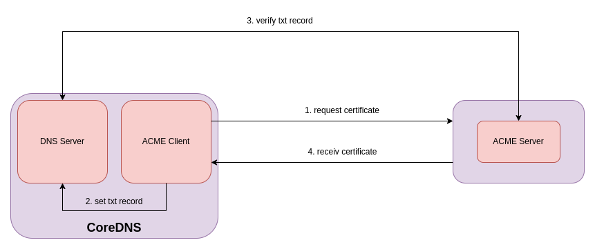

# tlsplus

## Name

*tlsplus* - generate and manage TLS certificates for you.

## Description

*tlsplus* is an alternative to the existing TLS plugin for CoreDNS, it can be used as a drop in replacement for the exisiting plugin and everything will continue to work.
What this plugin offers over the current builtin TLS plugin is the ability to generate and manage TLS certificates for you, so that you never have to worry about aquiring or renewing certificates,
all that will automatically be done for you.

CoreDNS supports queries that are encrypted using [TLS](https://datatracker.ietf.org/doc/html/rfc7858) or [HTTPS](https://datatracker.ietf.org/doc/html/rfc8484)
or are using gRPC (https://grpc.io/, not an IETF standard). Normally DNS traffic isn't encrypted at all (DNSSEC only signs resource records).
The *tlsplus* plugin allows you to either have CoreDNS generate and manage certificates for itself or configure the cryptographic keys yourself that are needed for all three
DNS-over-TLS, DNS-over-HTTPS or DNS-over-gRPC.

## Demo

The follwing show's a CoreDNS Server starting with the tlsplus plugin, obtaining a cerificate and serving DNS over TLS. 
To show the certificate renewal progress I have setup a local CA with [Pebble][Pebble] and issued a certificate that's only valid for 1 Minute.

https://user-images.githubusercontent.com/38843153/180786839-adcba9db-b883-4399-a4e4-a6e924b51df3.mov

## Usage

### Automatic

When CoreDNS is setup as the authoritative DNS Server for a domain such as `example.com`, all you need to add to your corefile to start serving DoT or DoH is the following:

~~~ txt
tlsplus acme {
    domain example.com
}
~~~

### Manual

~~~ txt
tls CERT KEY [CA]
~~~

Parameter CA is optional. If not set, system CAs can be used to verify the client certificate

## Test setup

All test can be run locally with

```
go test ./...
```

Port 14000 (ACME Server) and 1053 (CoreDNS) are required for integration tests


## How ACME works

The [ACME protocol][ACME] was invented by [Let's Encrypt][Let's Encrypt] with the objective of making it possible to
setup and HTTPS server and have it automatically obtain a browser-trusted certificate, without any human intervention.\
ACME is [client-server][client-server] protocol, the client first has to validate that he is in control of the domain that he wants
to obtain a certificate for.

Let’s Encrypt identifies the server administrator by public key. The first time the agent software interacts with
Let’s Encrypt, it generates a new key pair and proves to the Let’s Encrypt CA that the server controls one or more domains.
This is similar to the traditional CA process of creating an account and adding domains to that account.

Along with the challenges, the Let’s Encrypt CA also provides a nonce that the agent must sign with its private key pair
to prove that it controls the key pair.



The ACME Client then solves one of the challenges, in our case DNS-01, by setting the string "token123" as a TXT record
at \_acme\_challenge.example.com.



Once the ACME Client has proven ownership of a domain it can request, renew and revoke certificates for it through the
ACME Server.

## How this plugin integrates ACME into CoreDNS

Here is a diagramm that simplifies the ACME flow and show's how it is being integrated into CoreDNS.
CoreDNS in this case is both, an ACME Client and the DNS Server responsible for setting up TXT records.



[ACME]: https://datatracker.ietf.org/doc/html/rfc8555
[Let's Encrypt]: https://letsencrypt.org/
[client-server]: https://en.wikipedia.org/wiki/Client%E2%80%93server_model
[Pebble]: https://github.com/letsencrypt/pebble
